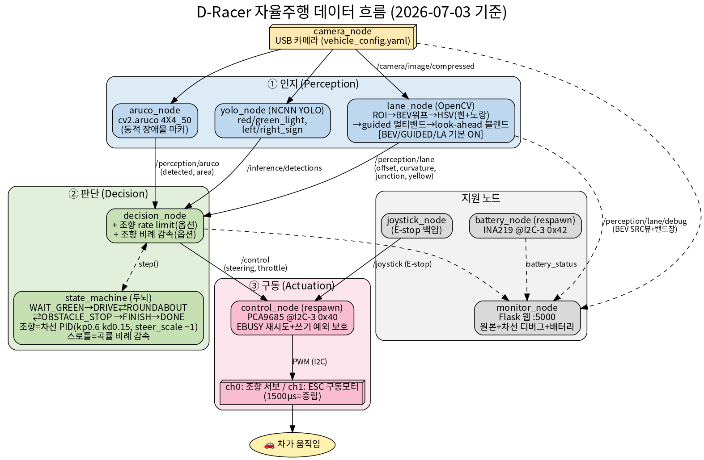

# SEAME_2026_Hackathon
TEAM : chita

---

## 🗺️ 전체 데이터 흐름 (자율주행 In 코스) (일단 in 코스만 구현함)

<p align="center">
  
</p>

```
카메라 → (차선·마커·신호등 3갈래 인지) → decision 두뇌가 판단 → /control → 모터
```
- **① 인지**: lane_node(차선) / aruco_node(마커) / yolo_ncnn_node(신호등·표지판)
- **② 판단**: decision_node(껍데기) + state_machine(두뇌: 미션 상태 + PID 조향 + 곡률감속)
- **③ 구동**: control_node → D3Racer/PCA9685 → 서보·모터

---

## 🔧 `taehulim` 브랜치 변경점 (자율주행 스택 보강)

공식 클론(main) 기준으로 **라인추종·회전교차로·YOLO**를 보강한 브랜치입니다.
자세한 원본 vs 변경 비교 → [`D-Racer-Kit/docs/CHANGES_lane_and_roundabout.md`](D-Racer-Kit/docs/CHANGES_lane_and_roundabout.md)

### 라인추종 (perception/lane_detector.py)
| | 원본(main) | 변경(taehulim) |
|---|---|---|
| 색 검출 | 흑백 밝기 임계값 (흰선만) | **HSV 흰색+노란색** (회전교차로 노란차선 대응) |
| 시야 | 단일 밴드(코앞만) | **멀티밴드 룩어헤드** (커브 미리 봄) |
| 강건성 | 평균 x (노이즈에 약함) | **노이즈정리(morph) + 차선폭 기억 + offset 평활** |
| 속도 | 일정 | **곡률 기반 감속** |

### 회전교차로 (decision/state_machine.py)
| | 원본(main) | 변경(taehulim) |
|---|---|---|
| 한 바퀴 판정 | **시간 8초** 만 | **junction(점선)+조향각적분+시간 3중 투표** (마커·IMU 없이) |
| 진입 감지 | 출발 즉시 진입 | **노란색+급커브 게이팅** (흰 코너 오진입 차단) |
| 조기 탈출 방지 | 없음 | **min_time 하드플로어+조향 바이어스** (1바퀴 미만 탈출=실패 방지) |
| 방향 대응 | 없음 | **race_dir** (정/역방향 트랙 일괄 설정) |

### 그 외
- **YOLO**: ultralytics → **ncnn 기반 `yolo_ncnn_node`** (ARM 보드 경량) + 학습모델(`models/`) 포함
- **ArUco**: 반전(inverted) 마커 지원 추가
- **테스트 모드**: `skip_missions:=true` → 라인추종만 단독 테스트
- **도구**: `tools/hsv_sampler.py`(색 측정), `tools/identify_aruco.py`(마커 식별)
- **삭제**: makedb, opencv(패키지), image_raw.jpg

### 실행 (라인추종만 테스트)
```bash
cd D-Racer-Kit
colcon build && source install/setup.bash
# 4개 노드: camera / lane / decision(skip_missions) / control
ros2 run decision decision_node --ros-args -p skip_missions:=true -p drive_throttle:=0.3
```

### 트랙에서 튜닝할 값
`kp/kd`(라인추종), `drive_throttle/slow_throttle`(ESC 데드밴드),
`yellow/white_hsv_*`(색, hsv_sampler로 실측), `nominal_loop_time_s`·`yaw_lap_threshold`(회전교차로),
`race_dir`(배정 방향) — 자세한 건 위 CHANGES 문서 참고.

---

## 🛠️ 트랙 튜닝 도구 (라이브 파라미터 · 설정저장 · 검출 시각화)

트랙에서 빠르고 안전하게 튜닝하기 위한 3종 도구.

### 1. 라이브 파라미터 — 재시작 없이 즉시 반영
`decision_node`/`lane_node`가 실행 중에도 `ros2 param set`이 **바로 적용**됩니다.
```bash
# 차 달리는 중에 실시간 튜닝 (노드 재시작 X)
ros2 param set /decision_node kp 0.8
ros2 param set /decision_node drive_throttle 0.3
ros2 param set /decision_node steer_scale -1.0        # 반대로 꺾이면
ros2 param set /lane_node yellow_hsv_lo "[15,90,90]"  # 조명 바뀌면
```

### 2. 설정 영구저장 — 좋은 값이 안 사라지게
`param set`은 재시작하면 초기화되므로, 찾은 값을 파일에 저장/불러오기.
```bash
# (a) 좋은 값으로 시작: 템플릿 불러오기
ros2 run decision decision_node --ros-args --params-file config/race_params.yaml
ros2 run perception lane_node   --ros-args --params-file config/race_params.yaml

# (b) 현재 튜닝값 저장 (두 노드 한 번에)
./tools/save_params.sh config/race_params.saved.yaml

# (c) 다음엔 저장한 파일로 시작
ros2 run decision decision_node --ros-args --params-file config/race_params.saved.yaml
```
> 튜닝 사이클: **파일로 시작 → 달리며 param set → 좋은 값 저장 → 다음에 그 파일로 시작**
> 파라미터 설명은 [`config/race_params.yaml`](D-Racer-Kit/config/race_params.yaml) 참고.

### 3. YOLO 검출 시각화 — 신호등이 잘 잡히는지 눈으로
`/inference/detections`를 카메라 영상에 **박스+라벨+신뢰도**로 그려 발행.
```bash
ros2 run inference detection_viz_node                       # /inference/viz/compressed 발행
ros2 run rqt_image_view rqt_image_view /inference/viz/compressed   # 영상 보기(GUI)
```
→ 신호등 비추면 `green_light 0.92` 박스 표시. **빨간 바닥 오검출**도 바로 확인 가능.
